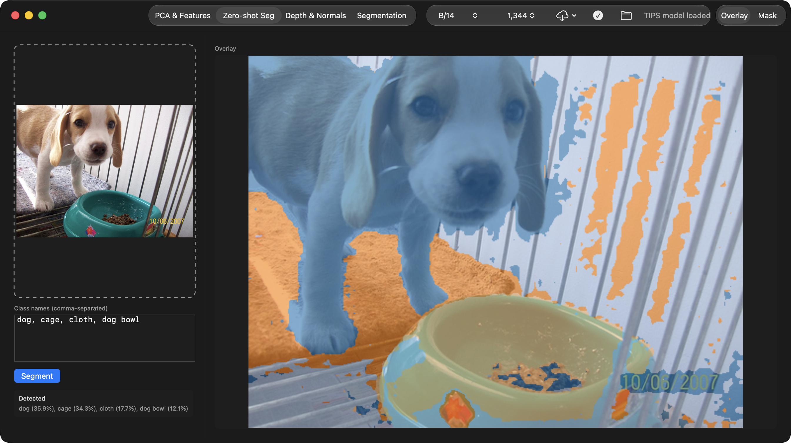

# mlx-swift-tipsv2

A Swift port of [**TIPS v2**](https://github.com/google-deepmind/tips) — Google DeepMind's contrastive vision-language model with spatially-aware patch features — built on [mlx-swift](https://github.com/ml-explore/mlx-swift) for Apple Silicon.

📖 [API documentation](https://mnmly.github.io/mlx-swift-tips/)

Supports zero-shot classification, zero-shot segmentation, PCA patch-feature visualisation, intermediate-layer extraction, and DPT dense-prediction heads (depth, surface normals, semantic segmentation).



| Variant | Vision params | Text params | FFN |
|---|---:|---:|---|
| `B` | 85.7 M | 109.6 M | MLP |
| `L` | 303.2 M | 183.9 M | MLP |
| `So400m` | 412.4 M | 448.3 M | MLP |
| `g` | 1.1 B | 389.1 M | SwiGLU |

---

## Requirements

- macOS 14 or later
- Swift 5.9+
- Dependencies (resolved automatically via SPM): [mlx-swift](https://github.com/ml-explore/mlx-swift), [swift-sentencepiece](https://github.com/jkrukowski/swift-sentencepiece), [swift-transformers](https://github.com/huggingface/swift-transformers) (Hub downloads), [swift-argument-parser](https://github.com/apple/swift-argument-parser) (CLI).

---

## Package structure

The library does all non-presentation work behind a single ``TIPSSession`` driver;
the CLI and the SwiftUI app are thin frontends over it, so they stay in lockstep.

```
Sources/TIPS/                 ← library target (MLXTIPS)
  Session.swift               TIPSSession + TIPSSessionConfig (the shared driver)
  Rendering.swift             TIPSRender — CGImage colormaps (PCA, turbo, normals, palettes)
  Hub.swift                   TIPSHub — reuse-or-download google/tipsv2-* checkpoints
  VisionTransformer.swift     PatchEmbed, VisionBlock, VisionTransformer
  TextEncoder.swift           TextAttention, TextResBlock, TextEncoder
  Decoders.swift              DPT heads (depth / normals / segmentation)
  TIPSModel.swift             TIPSModel wrapper, l2Normalize
  Pipeline.swift              TIPSPipeline / TIPSDPTPipeline (lower-level)
  WeightLoading.swift         TIPSWeightLoader, DPTVariantConfig
  Tokenizer.swift             TIPSTokenizer (SentencePiece, no BOS/EOS)
  Documentation.docc/         DocC catalog (published to GitHub Pages)
Examples/
  tips-cli/                   feature CLI (depth / normals / seg / pca / zeroseg / download)
  TIPSv2Demo/                 SwiftUI macOS app (Xcode project) driving TIPSSession
Tools/tips-bench/             benchmark CLI (mirrors Benchmarks/torch_tips_bench.py)
Tests/TIPSTests/              shape, parity, and Session/render tests
```

---

## Building

```bash
swift build -c release          # library + tips-cli + tips-bench
```

Run tests (use `xcodebuild` — `swift test` cannot load MLX's Metal library):

```bash
xcodebuild -scheme mlx-swift-tipsv2 -destination 'platform=macOS' test
```

The SwiftUI app builds from its own Xcode project:

```bash
xcodebuild -project Examples/TIPSv2Demo/TIPSv2Demo.xcodeproj \
  -scheme TIPSv2Demo -destination 'platform=macOS' build
```

---

## Quick start — `TIPSSession`

`TIPSSession` is the recommended entry point: one loaded-model handle that owns
the backbone (and optional DPT heads) and returns each task as a `CGImage` or a
small value type. It's `@unchecked Sendable` with a single-writer contract —
drive it from one thread / one detached `Task` at a time.

```swift
import MLXTIPS

// Reuse a cached checkpoint (or download it) into the standard HF cache.
let backbone = try await TIPSHub.resolve(repo: .b14)
let session = try TIPSSession.load(.init(backboneDirectory: backbone, variant: .B))

let cg = try TIPSSession.loadImage(at: URL(fileURLWithPath: "photo.jpg"))

// PCA feature visualisation → three CGImages (+ cached features for K-means).
let (pca, pcaDepth, spatial) = try session.pca(cg)
let kmeans = session.kmeans(spatial, nClusters: 8)

// Zero-shot dense segmentation (value-attention + TCL prompt ensemble).
let seg = try session.zeroShotSegment(cg, labels: ["dog", "cage", "cloth", "dog bowl"])
print(seg.detected)             // "dog (35.9%), cage (34.3%), cloth (17.7%), dog bowl (12.1%)"
// seg.overlay / seg.mask are full-resolution CGImages
```

Add a DPT checkpoint for depth / normals / ADE20K segmentation:

```swift
let dpt = try await TIPSHub.resolve(repo: .b14dpt)
let session = try TIPSSession.load(.init(
    backboneDirectory: backbone, dptDirectory: dpt, variant: .B))

let (depth, normals) = try session.depthAndNormals(cg)   // CGImage (turbo) + CGImage (RGB normals)
let semantic = try session.segmentation(cg)              // CGImage (ADE20K palette)
```

Every task method takes an optional `size:` to override the input resolution
per call (any multiple of the patch size, 14 — e.g. 448, 896, 1344). Higher
resolution yields finer patch grids and segmentation detail at the cost of
compute (attention is O(N²) in patch count).

The lower-level `TIPSPipeline` / `TIPSDPTPipeline` and the bare
`TIPSModel` / `TIPSWeightLoader` types remain available for custom forward-pass
or batching needs (see the API docs).

---

## Command line — `tips-cli`

`tips-cli` drives the same `TIPSSession` and writes PNGs. `--repo` resolves an
existing HF-cache snapshot or downloads it; `--backbone`/`--dpt` take explicit
snapshot directories instead.

```bash
swift build -c release        # binary at .build/release/tips-cli

# Download (or reuse) a checkpoint into the HF cache
tips-cli download google/tipsv2-b14

# PCA / PCA-depth / K-means
tips-cli pca      --repo google/tipsv2-b14 photo.jpg --out-dir out

# Zero-shot dense segmentation
tips-cli zeroseg  --repo google/tipsv2-b14 photo.jpg \
  --labels "dog,cage,cloth,dog bowl" --resolution 896 --out-dir out

# DPT depth + normals (needs a DPT checkpoint)
tips-cli depth    --repo google/tipsv2-b14 --dpt-repo google/tipsv2-b14-dpt photo.jpg --out-dir out

# DPT ADE20K semantic segmentation
tips-cli seg      --repo google/tipsv2-b14 --dpt-repo google/tipsv2-b14-dpt photo.jpg --out-dir out
```

---

## macOS app — `TIPSv2Demo`

`Examples/TIPSv2Demo` is a SwiftUI app (standalone Xcode project referencing the
local package) with tabs for PCA & Features, Zero-shot Seg, Depth & Normals, and
ADE20K Segmentation. The toolbar **Download** menu fetches `google/tipsv2-*`
checkpoints straight into the Hugging Face cache (reusing any already present),
with a variant and resolution picker. Open it in Xcode and run, or build via
`xcodebuild` (see above).

---

## Model weights

Checkpoints come from **Hugging Face** (`google/tipsv2-b14`, `…-l14`,
`…-so400m14`, `…-g14`, and their `-dpt` counterparts). `TIPSHub.resolve(repo:)`
prefers an existing snapshot in the standard `huggingface_hub` cache layout
(`~/.cache/huggingface/hub/models--…/snapshots/<hash>/`) so checkpoints already
downloaded by the Python client / demos are reused rather than re-fetched. This
repo does **not** redistribute weights.

`Conv2d` kernels are transposed NCHW → NHWC on load; the DPT `ConvTranspose2d`
`resize_layers` are additionally flipped 180° to match the
PyTorch/MLX transposed-convolution convention (the HF checkpoint stores the
Flax `transpose_kernel=False` layout).

---

## Benchmarks

Both this port and the upstream PyTorch reference are benchmarked through
`Benchmarks/torch_tips_bench.py` and `Tools/tips-bench/main.swift` with the
same iteration count, image, model variant, and dtype. See
[Benchmarks/README.md](Benchmarks/README.md) for reproduction commands.

**B14, 448 px input** — Apple M5 Max, 128 GB unified memory, macOS 26.5.
100 iterations after 10 warmup.

#### fp32

| Backend | Mode | median | mean | cold load |
|---|---|---:|---:|---:|
| PyTorch (MPS) | inference-only | 24.0 ms | 24.1 ms | 0.93 s |
| mlx-swift (Metal) | inference-only | 9.0 ms | 9.1 ms | 0.11 s |
| PyTorch (MPS) | end-to-end | 29.6 ms | 29.6 ms | — |
| mlx-swift (Metal) | end-to-end | 9.4 ms | 9.5 ms | — |

#### fp16

| Backend | Mode | median | mean | cold load |
|---|---|---:|---:|---:|
| PyTorch (MPS) | inference-only | 8.3 ms | 8.3 ms | 1.31 s |
| mlx-swift (Metal) | inference-only | 7.1 ms | 7.1 ms | 0.20 s |
| PyTorch (MPS) | end-to-end | 14.4 ms | 14.4 ms | — |
| mlx-swift (Metal) | end-to-end | 7.6 ms | 7.6 ms | — |

At fp16 — the dtype most production inference uses — the inference-only gap is
only ~17%. Rerun on your hardware before quoting speedups.

---

## Parity

Numerical parity against [mlx-tips](https://github.com/mnmly/mlx-tips) (the
Python MLX reference). Generate fixtures from the Python package, then:

```sh
TIPS_SNAPSHOT_DIR=/path/to/snapshots/245de45... swift test --filter ParityTests
```

All cosine similarities ≥ 0.9999, max_err ≤ 0.02:

```
[cls_token]        max_err=4.20e-04  cosine=1.000000
[register_tokens]  max_err=2.70e-04  cosine=1.000000
[patch_tokens]     max_err=6.91e-03  cosine=1.000000
[text_embeddings]  max_err=4.39e-04  cosine=1.000000
```

The DPT heads track the *corrected* deepmind reference (`pytorch/decoders.py`,
"Scenic parity"): tanh-approx GELU in the reassemble readout, no activation
after the DPT `project` conv, and the 180° ConvTranspose kernel flip.

---

## Documentation

API reference is generated with [swift-docc-plugin](https://github.com/swiftlang/swift-docc-plugin)
and published to GitHub Pages at **https://mnmly.github.io/mlx-swift-tips/**
(built on push to `main` by `.github/workflows/docs.yml`).

Build the docs locally:

```bash
scripts/build_docs.sh            # static site → docs/
scripts/build_docs.sh preview    # live-reload preview
```

---

## Implementation notes

- **Vision tower**: DINOv2-style ViT with 1 register token, LayerScale (`initValues=1.0`), MLP or SwiGLU FFN (fused, DINOv2 hidden-size rounding `(int(h·2/3)+7)//8·8`). Positional embeddings are bilinearly interpolated from the checkpoint grid (32×32) to any input resolution.
- **Text tower**: Transformer with sinusoidal positional embeddings, ReLU MLP with padding-mask-gated FFN, mean-pooling over unpadded tokens, SentencePiece tokenizer (lowercased, no BOS/EOS).
- **DPT heads**: `ReassembleBlocks` → per-level `Conv2d` → 4× `FeatureFusionBlock` (2× bilinear upsample per block) → task-specific linear head. Depth via soft-binning over linearly-spaced bins.
- **Zero-shot segmentation**: value-attention ("values trick") patch features matched against a TCL prompt-ensemble per label; the similarity map is bilinearly upsampled to full resolution before argmax for smooth boundaries.
- **Attention**: `MLXFast.scaledDotProductAttention` throughout.
- **Weight layout**: all convolutions stored NHWC (channels-last).
- **Lazy evaluation**: model init and forward passes are lazy; call `eval(...)` only when you need materialised values.

---

## Porting provenance

This port tracks the upstream [google-deepmind/tips](https://github.com/google-deepmind/tips)
PyTorch reference, pinned to the commit it was last reconciled against:

| Upstream | Commit | Date |
|---|---|---|
| [google-deepmind/tips](https://github.com/google-deepmind/tips) `main` | [`4db271d`](https://github.com/google-deepmind/tips/commit/4db271d3b9622b901cf4a1a821e4cb7a5e6b2490) | 2026-06-01 |

The DPT decoder logic follows the **corrected** `pytorch/decoders.py` at `4db271d`
(landed in commit `b9d4418`, "Scenic parity"): tanh-approx GELU in the reassemble
readout, no activation after the DPT `project` conv, and the 180° ConvTranspose
kernel flip. Note that the `google/tipsv2-*-dpt` Hugging Face checkpoint bundles
an **older** `dpt_head.py` that predates these fixes — this port matches the
corrected reference, not that bundled module.

---

## License

This Swift port is released under the **Apache License 2.0** — see [`LICENSE`](LICENSE) — matching the upstream model's license.

The upstream TIPS weights and reference PyTorch code are Copyright 2025 Google DeepMind / Google LLC, also Apache-2.0. This repository does **not** redistribute the weights; they are downloaded from Hugging Face on first use.

See the [upstream repository](https://github.com/google-deepmind/tips) and the [HF model card](https://huggingface.co/google/tipsv2-b14) for full terms and intended use.
